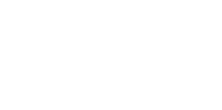

<p align="center">
  
</p>

## CavemanLifting

## Getting started

1. Clone the repo

```
git clone https://github.com/Aothe/CavemanLifting
cd server
```

2. Install dependencies

```
npm install
```

3. Start server

```
nodemon
```

4. Start development server

```
follow steps 1 through 3, using cd client instead of server
use npm start in place of nodemon
```

4. Populate DB

```
To be done, script for populating DB
```

## Tech Stack

- [React](https://reactjs.org/)
- [MongoDB](https://www.mongodb.com/)
- [Express](https://expressjs.com/)
